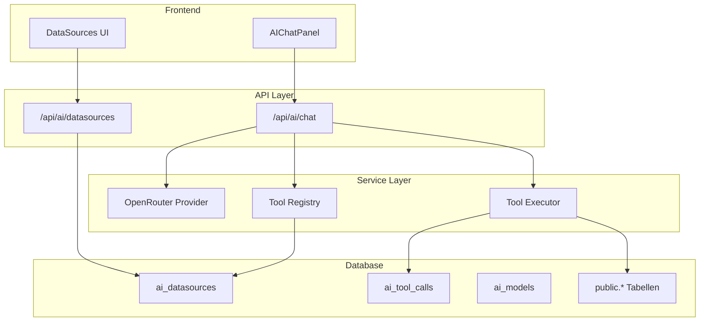

# AI Agent System mit OpenRouter und Tool-Calling

## Architektur-Übersicht

## Kernentscheidungen

| Aspekt | Entscheidung |

|--------|--------------|

| Provider | Vercel AI SDK mit `@ai-sdk/openai` (OpenRouter-kompatibel) |

| Fallback | Keiner - Fehlermeldung bei Nicht-Erreichbarkeit |

| Migration | Bestehende `/api/chat` Route komplett ersetzen |

| Tabellen | Alle `public.*` Tabellen automatisch erkennen |

| Bestätigung | Dry-Run first, dann Bestätigung im Chat |---

## Phase 0: Vorbereitung und Connectivity-Test

### 0.1 OpenRouter API Key ins Vault speichern

- Key `OPENROUTER_API_KEY` im Supabase Vault anlegen
- [scripts/pull-env.mjs](scripts/pull-env.mjs) ausführen um Key lokal verfügbar zu machen

### 0.2 Context7 MCP Verbindung prüfen

- Context7 muss für aktuelle Dokumentation verfügbar sein
- Falls nicht verbunden: MCP Server neu starten

### 0.3 Connectivity-Test-Script erstellen

Neues Script `scripts/test-openrouter.ts`:

- Testet API-Erreichbarkeit
- Testet verfügbare Modelle
- Testet Vision-Capability mit Test-Bild
- **MUSS erfolgreich sein bevor Phase 1 beginnt**

---

## Phase 1: OpenRouter Integration (mit Vercel AI SDK)

### 1.1 Context7 konsultieren

- Aktuelle Vercel AI SDK Dokumentation abrufen
- OpenRouter-spezifische Konfiguration prüfen

### 1.2 OpenRouter Provider konfigurieren

Neue Datei `src/lib/ai/openrouter-provider.ts`:

- Verwendet `@ai-sdk/openai` mit custom baseURL
- Konfiguration für `openrouter.ai/api/v1`
- Export von `openrouter` Provider-Instanz

### 1.3 Environment Schema erweitern

[src/env.mjs](src/env.mjs) anpassen:

- `OPENROUTER_API_KEY` zum Server-Schema hinzufügen
- Validierung sicherstellen

### 1.4 Test: Provider-Integration

Test-Datei `src/lib/ai/__tests__/openrouter-provider.test.ts`:

- Unit-Test für Provider-Konfiguration
- Integration-Test für einfache Chat-Completion
- Vision-Test mit Base64-Bild

---

## Phase 2: Datenbank-Migration für AI Datasources

### 2.1 Context7 konsultieren

- Supabase RLS Best Practices
- JSON Schema Generierung

### 2.2 Migration erstellen

Neue Datei `supabase/migrations/018_ai_datasources.sql`:

- `ai_access_level` ENUM (none, read, read_write, full)
- `ai_datasources` Tabelle (Tabellen-Berechtigungen)
- `ai_tool_calls` Tabelle (Audit-Log)
- `ai_models` Tabelle (verfügbare Modelle)
- RLS Policies (Admin-only für Verwaltung)
- Helper-Funktion `get_table_columns` für Schema-Introspection

### 2.3 Auto-Discovery für public.* Tabellen

Funktion in Migration:

- Liest `information_schema.tables`
- Erstellt initiale `ai_datasources` Einträge für alle public-Tabellen
- Default: `access_level = 'none'` (sicher)

### 2.4 Test: Migration

Test-Datei `supabase/migrations/__tests__/018_ai_datasources.test.ts`:

- Prüft Tabellen-Erstellung
- Prüft RLS Policies
- Prüft Auto-Discovery Funktion

---

## Phase 3: Tool Registry

### 3.1 Context7 konsultieren

- OpenAI Tool/Function Calling Schema
- JSON Schema Generierung Best Practices

### 3.2 Tool Registry implementieren

Neue Datei `src/lib/ai/tool-registry.ts`:

- `loadDataSources()` - Lädt aktivierte Datasources aus DB
- `generateToolsForTable()` - Generiert Tools basierend auf Schema
- `generateAllTools()` - Alle verfügbaren Tools
- `validateToolCall()` - Permission-Check

### 3.3 Test: Tool Registry

Test-Datei `src/lib/ai/__tests__/tool-registry.test.ts`:

- Unit-Tests für Tool-Generierung
- Permission-Validierung Tests
- Schema-zu-JSON-Schema Mapping Tests

---

## Phase 4: Tool Executor mit Dry-Run

### 4.1 Tool Executor implementieren

Neue Datei `src/lib/ai/tool-executor.ts`:

- `executeQuery()` - SELECT mit Filtern
- `executeInsert()` - INSERT mit Dry-Run
- `executeUpdate()` - UPDATE mit Dry-Run
- `executeDelete()` - DELETE mit Bestätigung
- `logToolCall()` - Audit-Logging

### 4.2 Dry-Run Logik

- Jeder schreibende Call generiert erst SQL-Preview
- AI zeigt Preview im Chat
- User bestätigt mit "Ja" oder "Ausführen"
- Erst dann echte Ausführung

### 4.3 Test: Tool Executor

Test-Datei `src/lib/ai/__tests__/tool-executor.test.ts`:

- Dry-Run Tests
- Audit-Logging Tests
- Permission-Enforcement Tests
- Excluded-Columns Tests

---

## Phase 5: Neue Chat API Route

### 5.1 Context7 konsultieren

- Vercel AI SDK streamText/generateText
- Tool-Calling Loop Pattern

### 5.2 Bestehende Route analysieren

[src/app/api/chat/route.ts](src/app/api/chat/route.ts) verstehen:

- Screenshot-Handling
- Wiki-Content Loading
- Interaction-Context

### 5.3 Neue Route implementieren

Datei überschreiben `src/app/api/chat/route.ts`:

- OpenRouter Provider statt direktem Google
- Tool-Definitions aus Registry
- Agentic Loop für Tool-Calls (max 5 Iterationen)
- Dry-Run Integration
- Bestehenden Kontext (Screenshot, Wiki, Interactions) beibehalten

### 5.4 Test: Chat API

Test-Datei `src/app/api/chat/__tests__/chat-api.test.ts` erweitern:

- OpenRouter-Integration Test
- Tool-Calling Test
- Dry-Run Flow Test
- Error-Handling Test

---

## Phase 6: Frontend - AIChatPanel Update

### 6.1 AIChatPanel anpassen

[src/components/shell/AIChatPanel.tsx](src/components/shell/AIChatPanel.tsx):

- Keine Änderungen am Model-Adapter nötig (API bleibt gleich)
- Optional: Tool-Call Status-Anzeige
- Optional: Dry-Run Preview Styling

### 6.2 Test: E2E Chat Flow

Playwright-Test `e2e/ai-chat.spec.ts`:

- Chat öffnen
- Nachricht senden
- Antwort empfangen
- Tool-Call auslösen (z.B. "Zeige mir alle Themes")

---

## Phase 7: Admin UI für Datasources

### 7.1 Navigation erweitern

[src/config/navigation.ts](src/config/navigation.ts):

- Neuer Eintrag "AI Datenquellen" unter Account
- Icon: `Database` von lucide-react
- `requiredRoles: ["admin"]`

### 7.2 Datasources-Seite erstellen

Neue Dateien:

- `src/app/(shell)/account/ai-datasources/page.tsx` - Übersicht
- `src/app/(shell)/account/ai-datasources/components/DatasourceTable.tsx`
- `src/app/(shell)/account/ai-datasources/components/AccessLevelSelect.tsx`

### 7.3 API Route für Datasources

Neue Datei `src/app/api/ai/datasources/route.ts`:

- GET: Liste aller Datasources
- PATCH: Access-Level ändern
- Nur für Admins

### 7.4 Test: Admin UI

Playwright-Test `e2e/ai-datasources.spec.ts`:

- Als Admin einloggen
- Datasources-Seite öffnen
- Access-Level ändern
- Änderung verifizieren

---

## Dateiübersicht

| Datei | Aktion | Phase |

|-------|--------|-------|

| `scripts/test-openrouter.ts` | Neu | 0 |

| `src/lib/ai/openrouter-provider.ts` | Neu | 1 |

| `src/env.mjs` | Ändern | 1 |

| `supabase/migrations/018_ai_datasources.sql` | Neu | 2 |

| `src/lib/ai/tool-registry.ts` | Neu | 3 |

| `src/lib/ai/tool-executor.ts` | Neu | 4 |

| `src/app/api/chat/route.ts` | Ersetzen | 5 |

| `src/components/shell/AIChatPanel.tsx` | Minimal ändern | 6 |

| `src/config/navigation.ts` | Ändern | 7 |

| `src/app/(shell)/account/ai-datasources/*` | Neu | 7 |

| `src/app/api/ai/datasources/route.ts` | Neu | 7 |---

## Testplan pro Phase

| Phase | Unit Tests | Integration Tests | E2E Tests |

|-------|-----------|------------------|-----------|

| 0 | - | Connectivity Script | - |

| 1 | Provider Config | Chat Completion | - |

| 2 | - | Migration | - |

| 3 | Tool Generation | Permission Check | - |

| 4 | Dry-Run, Audit | Executor Flow | - |

| 5 | - | API Route | - |

| 6 | - | - | Chat Flow |

| 7 | - | API Route | Admin UI |---

## Wichtige Hinweise

1. **Context7 vor jeder Phase**: Aktuelle Dokumentation abrufen
2. **Tests vor Weiterarbeit**: Jede Phase muss Tests bestehen
3. **Phase 0 ist kritisch**: Ohne erfolgreichen Connectivity-Test keine weitere Arbeit
4. **Inkrementell**: Eine Phase nach der anderen, nicht parallel