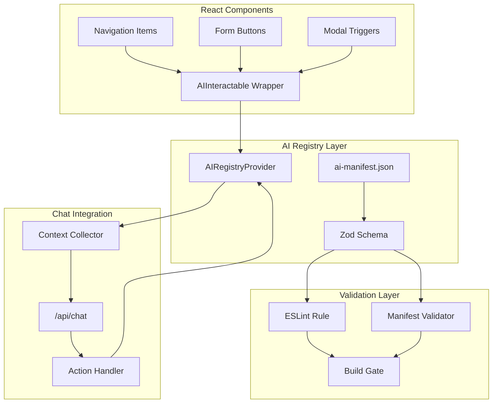

# AI Component Governance System

## Architektur



## Dateien die erstellt werden

| Datei | Beschreibung |

|-------|--------------|

| `src/lib/ai/ai-manifest.schema.ts` | Zod-Schema fuer Manifest-Validierung |

| `src/lib/ai/ai-registry-context.tsx` | Provider + Hooks fuer Component Registry |

| `src/components/ai/AIInteractable.tsx` | Wrapper-Komponente |

| `ai-manifest.json` | Zentrale Manifest-Datei (Root) |

| `scripts/validate-ai-manifest.ts` | Build-Validierungs-Script |

| `eslint/rules/ai-component-compliance.js` | ESLint-Regel |

## Dateien die modifiziert werden

| Datei | Aenderung |

|-------|-----------|

| `src/app/layout.tsx` | AIRegistryProvider einbinden |

| `src/components/shell/AIChatPanel.tsx` | Action-Handler erweitern |

| `src/lib/ai-chat/context-collector.ts` | availableActions sammeln |

| `src/app/api/chat/route.ts` | UI-Action Tool generieren |

| `src/lib/ai/model-router.ts` | UI-Keywords hinzufuegen |

| `src/components/shell/Navbar.tsx` | Navigation mit AIInteractable wrappen |

| `eslint.config.mjs` | Neue Regel registrieren |

| `package.json` | validate:ai Script |---

## Phase 1: Schema und Manifest (Grundlage)

### 1.1 Zod-Schema erstellen

Neue Datei: `src/lib/ai/ai-manifest.schema.ts`

- AIActionType enum: navigate, toggle, submit, open-modal, close-modal, select, input, trigger
- AIComponentSchema mit Validierung fuer id (kebab-case), description (10-200 chars), keywords (min 2)
- AIManifestSchema fuer die komplette Manifest-Struktur
- Export der TypeScript Types

### 1.2 Initial Manifest erstellen

Neue Datei: `ai-manifest.json` (Root)Initiale Komponenten:

- Navigation (alle Items aus `src/config/navigation.ts`)
- Panel-Toggles (navbar, explorer, assist)
- Theme-Switcher
- Logout-Action

---

## Phase 2: Registry und Wrapper-Komponente

### 2.1 AIRegistryProvider erstellen

Neue Datei: `src/lib/ai/ai-registry-context.tsx`

- AIAction Interface mit id, action, target, description, keywords, isAvailable, execute
- AIRegistryContext mit actions Map
- register/unregister Funktionen
- executeAction Funktion
- getAvailableActions Funktion
- useAIRegistry Hook

### 2.2 AIInteractable Wrapper erstellen

Neue Datei: `src/components/ai/AIInteractable.tsx`

- Props: id, action, target, description, availableWhen, children
- useEffect fuer automatische Registrierung
- data-ai-id Attribut auf Container
- Manifest-Lookup fuer Keywords

### 2.3 Provider in Layout einbinden

Modifizieren: `src/app/layout.tsx`

- AIRegistryProvider um die App wrappen

---

## Phase 3: Chat-Integration

### 3.1 Context Collector erweitern

Modifizieren: `src/lib/ai-chat/context-collector.ts`

- Neue Funktion: collectAvailableActions()
- Liest registrierte Actions aus dem DOM (data-ai-id)
- Gibt Array mit { id, description, action, target } zurueck

### 3.2 Chat-API erweitern

Modifizieren: `src/app/api/chat/route.ts`

- availableActions aus Request-Body lesen
- Dynamisches execute_ui_action Tool generieren
- Tool-Result mit \_\_ui_action Marker

### 3.3 Action-Handler in AIChatPanel

Modifizieren: `src/components/shell/AIChatPanel.tsx`

- useAIRegistry Hook einbinden
- onFinish erweitern: \_\_ui_action erkennen
- executeAction aufrufen bei UI-Actions

### 3.4 Model-Router erweitern

Modifizieren: `src/lib/ai/model-router.ts`

- Neue UI_KEYWORDS Liste hinzufuegen
- Routing-Logik: UI-Keywords -> Tool-Model (braucht Tool-Calling)

---

## Phase 4: Komponenten wrappen

### 4.1 Navigation wrappen

Modifizieren: `src/components/shell/Navbar.tsx`

- Alle NavItems mit AIInteractable wrappen
- IDs aus navigation.ts ableiten (nav-{item.id})

### 4.2 Panel-Toggles wrappen

Komponenten die gewrapped werden:

- Navbar Toggle Button
- Explorer Toggle Button
- Assist Panel Buttons (Chat, Wiki, etc.)

### 4.3 Weitere Komponenten (iterativ)

- Theme-Switcher
- Logout-Button
- Form-Submit-Buttons
- Modal-Trigger

---

## Phase 5: Validierung und Build-Gate

### 5.1 ESLint-Regel erstellen

Neue Datei: `eslint/rules/ai-component-compliance.js`Prueft:

- AIInteractable hat id Prop
- AIInteractable hat description Prop
- id ist im Manifest registriert
- id ist kebab-case

### 5.2 Manifest-Validator erstellen

Neue Datei: `scripts/validate-ai-manifest.ts`Prueft:

- Manifest-Schema valide (Zod)
- Alle AIInteractable IDs im Code sind im Manifest
- Keine Keyword-Duplikate
- Alle Manifest-Eintraege werden verwendet (Warning)

### 5.3 Build-Integration

Modifizieren: `package.json`

```json
"scripts": {
  "validate:ai": "tsx scripts/validate-ai-manifest.ts",
  "build": "pnpm validate:ai && next build"
}
```

Modifizieren: `eslint.config.mjs`

- ai-component-compliance Regel registrieren

---

## Phase 6: Tests

### 6.1 Unit Tests

Neue Dateien:

- `src/lib/ai/__tests__/ai-manifest.schema.test.ts` - Schema-Validierung
- `src/lib/ai/__tests__/ai-registry-context.test.tsx` - Registry-Funktionen
- `src/components/ai/__tests__/AIInteractable.test.tsx` - Wrapper-Komponente

### 6.2 Integration Tests

Neue Datei: `src/lib/ai/__tests__/ai-chat-integration.test.ts`

- Test: UI-Action Tool wird generiert
- Test: Action-Handler fuehrt Aktionen aus

### 6.3 Validator Tests

Neue Datei: `scripts/__tests__/validate-ai-manifest.test.ts`

- Test: Valides Manifest wird akzeptiert
- Test: Fehlende ID wird erkannt
- Test: Ungueltige ID wird erkannt

---

## Phase 7: Dokumentation

### 7.1 Feature-Dokumentation

Neue Datei: `docs/03_features/ai-component-governance.md`

- Architektur-Uebersicht
- Manifest-Schema Referenz
- Komponenten-Wrapping Guide
- Naming Conventions
- Troubleshooting

### 7.2 Findings-Dokumentation aktualisieren

Modifizieren: `docs/03_features/ai-tool-calling-findings.md`

- UI-Action Tools dokumentieren
- Action-Handler Pattern beschreiben

---

## Erfolgskriterien

1. User kann sagen "Navigiere zur User-Liste" und die App navigiert
2. User kann sagen "Klappe die Sidebar ein" und sie klappt ein
3. Build schlaegt fehl wenn AIInteractable ohne Manifest-Eintrag verwendet wird
4. Alle Tests bestehen
