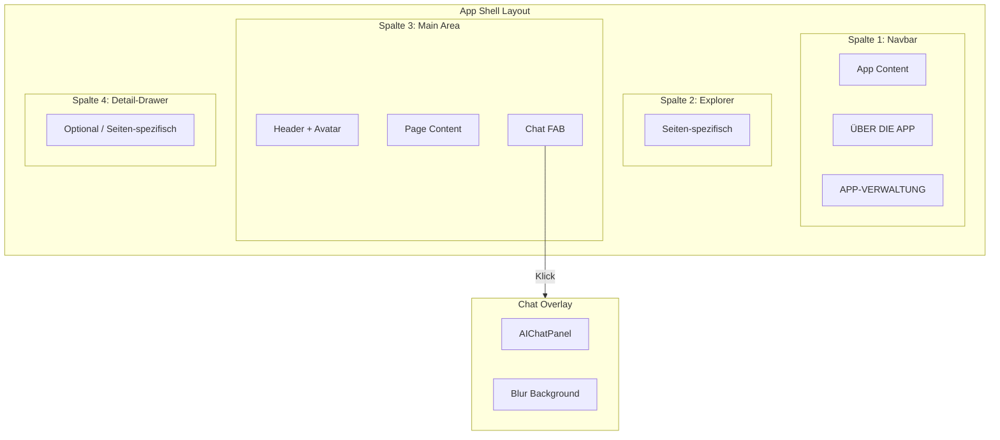
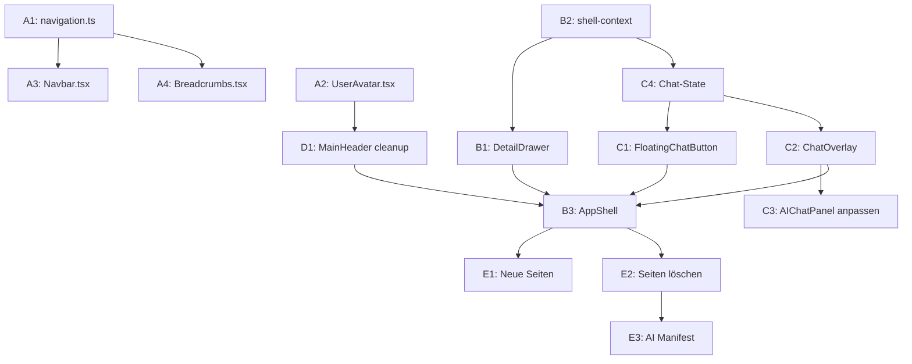

# App Shell Umstrukturierung v2

## Architektur-Überblick (NEU)



---

## Teil A: Navbar & Account (wie bisher geplant)

### A1. Navigation Config anpassen

**Datei:** [`src/config/navigation.ts`](src/config/navigation.ts)

- "About the App" → "ÜBER DIE APP"
- ENTFERNEN: `about-cocoding`
- "Impressum / Kontakt" → "Impressum"
- NEUE Sektion "APP-VERWALTUNG" (admin-only)
- Account-Sektion aus `navigationConfig` entfernen

### A2. Avatar-Dropdown erstellen

**Neue Datei:** `src/components/shell/UserAvatar.tsx`

- ShadCN Avatar installieren
- Dropdown: User-Info, Warenkorb, Sprache, Abmelden

### A3. Navbar anpassen

**Datei:** [`src/components/shell/Navbar.tsx`](src/components/shell/Navbar.tsx)

- Account-Sektion komplett entfernen
- APP-VERWALTUNG Sektion hinzufügen

### A4. Breadcrumbs aktualisieren

**Datei:** [`src/components/shell/Breadcrumbs.tsx`](src/components/shell/Breadcrumbs.tsx)

- labelMappings für neue Routen anpassen

---

## Teil B: Spalte 4 → Detail-Drawer (NEU)

### B1. AssistPanel zu DetailDrawer umbauen

**Datei:** [`src/components/shell/AssistPanel.tsx`](src/components/shell/AssistPanel.tsx) → Umbenennen zu `DetailDrawer.tsx`**Änderungen:**

- Tabs-System entfernen (Chat, Wiki, Comments, Cart)
- Slot-basiertes System: Seite definiert Inhalt oder Drawer ist versteckt
- Wenn kein Content → Panel komplett hidden (ResizablePanel collapsed)

### B2. Shell Context anpassen

**Datei:** [`src/components/shell/shell-context.tsx`](src/components/shell/shell-context.tsx)**Änderungen:**

- `AssistPanelType` entfernen (keine Tabs mehr)
- Neuer State: `detailDrawerContent: ReactNode | null`
- Wenn `null` → Drawer versteckt

### B3. AppShell Layout anpassen

**Datei:** [`src/components/shell/AppShell.tsx`](src/components/shell/AppShell.tsx)

- Spalte 4 nur rendern wenn `detailDrawerContent !== null`
- Oder: `collapsedSize={0}` wenn kein Content

---

## Teil C: Floating Chat Overlay (NEU)

### C1. FloatingChatButton (FAB) erstellen

**Neue Datei:** `src/components/shell/FloatingChatButton.tsx`

```javascript
Position: fixed, bottom-right (z.B. bottom-6 right-6)
Aussehen: Runder Button, Chat-Icon
Verhalten:
    - Geschlossen: Chat-Icon
    - Offen: X-Icon (Close)
Animation: Smooth transform zwischen Icons
```

### C2. ChatOverlay erstellen

**Neue Datei:** `src/components/shell/ChatOverlay.tsx`

```javascript
Features:
- Halbtransparenter Blur-Background (backdrop-blur)
- Resizable (react-resizable-panels oder eigene Lösung)
- Positioniert unten rechts, schwebt über Content
- Enthält den bestehenden AIChatPanel
- Close via FAB oder Escape-Key
```

### C3. AIChatPanel anpassen

**Datei:** [`src/components/shell/AIChatPanel.tsx`](src/components/shell/AIChatPanel.tsx)

- Aus dem Assist-Tabs-System herauslösen
- Standalone-fähig machen für Overlay-Nutzung
- Höhe/Breite flexibel (nicht mehr fixed)

### C4. Chat-State in Shell Context

**Datei:** [`src/components/shell/shell-context.tsx`](src/components/shell/shell-context.tsx)

```typescript
// NEU
chatOverlayOpen: boolean
toggleChatOverlay: () => void
```

---

## Teil D: MainHeader aufräumen (NEU)

### D1. Assist-Buttons entfernen

**Datei:** [`src/components/shell/MainHeader.tsx`](src/components/shell/MainHeader.tsx)**ENTFERNEN:**

- `assistButtons` Array komplett
- Chat, Wiki, Comments, Cart Icons
- Die ganze rechte Button-Gruppe (außer Avatar)

**BEHALTEN:**

- Navbar-Toggle links
- Breadcrumbs
- UserAvatar (neu)

---

## Teil E: Seiten & Cleanup

### E1. Neue Dummy-Seiten erstellen

| Route | Titel ||-------|-------|| /admin/dashboard | App-Dashboard || /admin/chat-logs | KI-Chat-Logs || /account/language | Sprache |

### E2. Seiten löschen

| Pfad | Grund ||------|-------|| `src/app/(shell)/about/co-coding/` | Entfernt || `src/app/(shell)/account/layout-templates/` | Komplett entfernt |

### E3. AI Manifest aktualisieren

- Neue Routen hinzufügen
- Entfernte Routen löschen
- Assist-Panel Actions entfernen

---

## Risiko-Analyse (erweitert)

| Risiko | Auswirkung | Mitigation ||--------|------------|------------|| Chat-Overlay z-index Konflikte | Chat unter anderen Elementen | z-index höher als Modals setzen || Resizable kompliziert | Bugs bei Größenänderung | Erst fixed size, dann resizable || Detail-Drawer pro Seite | Komplexe State-Logik | Klares API-Design vorab || FAB überlappt Content | Nicht klickbare Bereiche | padding-bottom auf Seiten || Blur-Performance | Langsam auf alten Geräten | Fallback ohne Blur |---

## Implementierungs-Reihenfolge



---

## Test-Checkliste

### Nach Teil A (Navbar):

- [ ] ÜBER DIE APP Sektion korrekt
- [ ] APP-VERWALTUNG nur für Admin sichtbar
- [ ] Avatar-Dropdown funktioniert
- [ ] Logout funktioniert

### Nach Teil B (Detail-Drawer):

- [ ] Seite ohne Detail-Content → keine Spalte 4
- [ ] Seite mit Detail-Content → Spalte 4 sichtbar
- [ ] Resize funktioniert

### Nach Teil C (Chat-Overlay):

- [ ] FAB unten rechts sichtbar
- [ ] Klick öffnet Overlay
- [ ] FAB wird zu X-Icon
- [ ] Chat funktioniert im Overlay
- [ ] Resize funktioniert
- [ ] Escape schließt Overlay
- [ ] Blur-Background sichtbar

### Nach Teil D (MainHeader):

- [ ] Keine Assist-Buttons mehr
- [ ] Nur Avatar rechts
- [ ] Breadcrumbs funktionieren

### Finale Tests:

- [ ] Browser Console fehlerfrei
- [ ] KI-Chat: Befehle funktionieren
- [ ] Mobile: FAB nicht im Weg
- [ ] Performance: Blur flüssig

---

## Datei-Übersicht

| Aktion | Datei ||--------|-------|| Bearbeiten | `src/config/navigation.ts` || Bearbeiten | `src/components/shell/Navbar.tsx` || Bearbeiten | `src/components/shell/MainHeader.tsx` || Bearbeiten | `src/components/shell/Breadcrumbs.tsx` || Bearbeiten | `src/components/shell/shell-context.tsx` || Bearbeiten | `src/components/shell/AppShell.tsx` || Bearbeiten | `src/components/shell/AIChatPanel.tsx` || Umbenennen | `AssistPanel.tsx` → `DetailDrawer.tsx` || Erstellen | `src/components/ui/avatar.tsx` (via shadcn) || Erstellen | `src/components/shell/UserAvatar.tsx` || Erstellen | `src/components/shell/FloatingChatButton.tsx` || Erstellen | `src/components/shell/ChatOverlay.tsx` || Erstellen | `src/app/(shell)/admin/dashboard/page.tsx` || Erstellen | `src/app/(shell)/admin/chat-logs/page.tsx` || Erstellen | `src/app/(shell)/account/language/page.tsx` || Löschen | `src/app/(shell)/about/co-coding/` |
